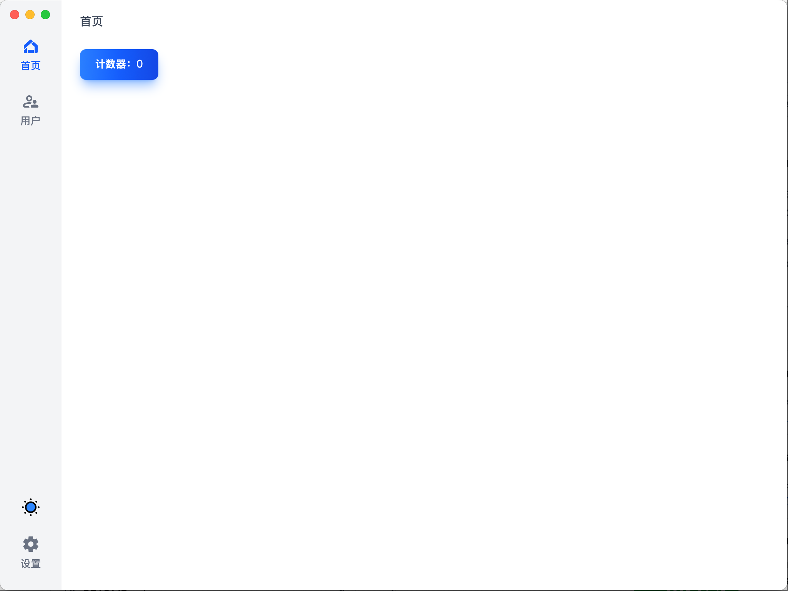
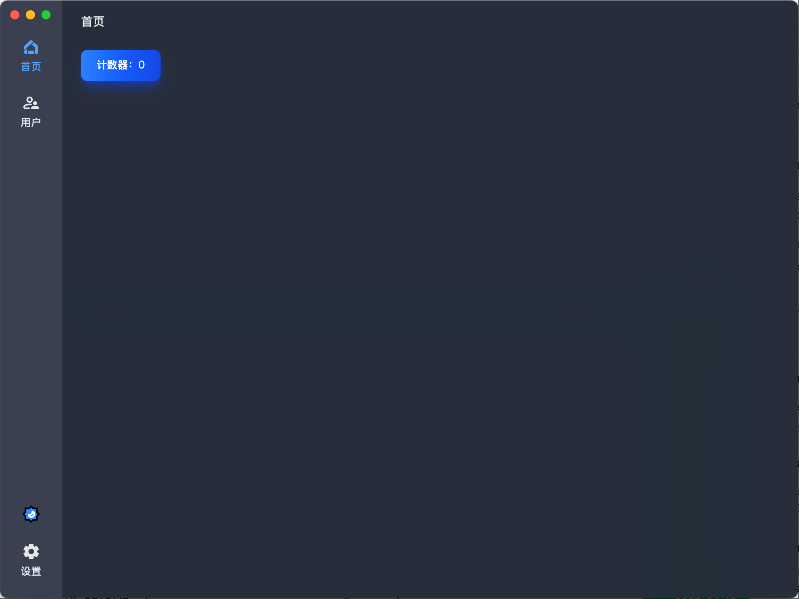

# Welcome to Your New Wails3 Project!

Congratulations on generating your Wails3 application! This README will guide you through the next steps to get your project up and running.

## Screenshot




## Getting Started

1. Navigate to your project directory in the terminal.

2. To run your application in development mode, use the following command:

   ```
   wails3 dev
   ```

   This will start your application and enable hot-reloading for both frontend and backend changes.

3. To build your application for production, use:

   ```
   wails3 build
   ```

   This will create a production-ready executable in the `build` directory.

## Exploring Wails3 Features

## Screenshot


## About

This is the official Wails React-TS template.

You can configure the project by editing `wails.json`. More information about the project settings can be found
here: https://wails.io/docs/reference/project-config

## Live Development

To run in live development mode, run `wails dev` in the project directory. This will run a Vite development
server that will provide very fast hot reload of your frontend changes. If you want to develop in a browser
and have access to your Go methods, there is also a dev server that runs on http://localhost:34115. Connect
to this in your browser, and you can call your Go code from devtools.

## Building

To build a redistributable, production mode package, use `wails build`.
